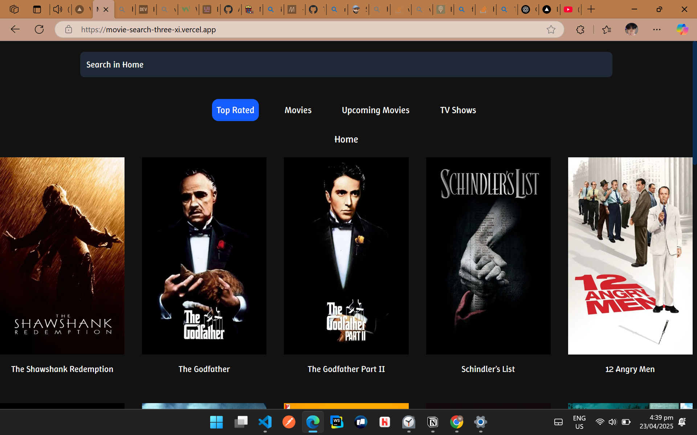
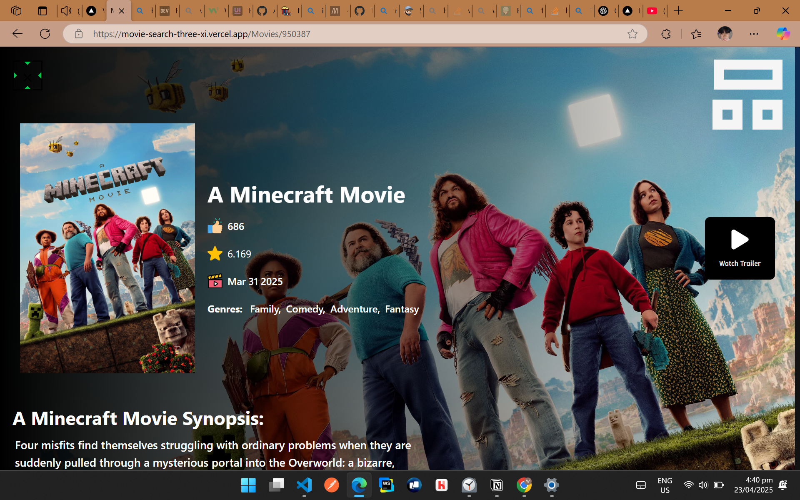
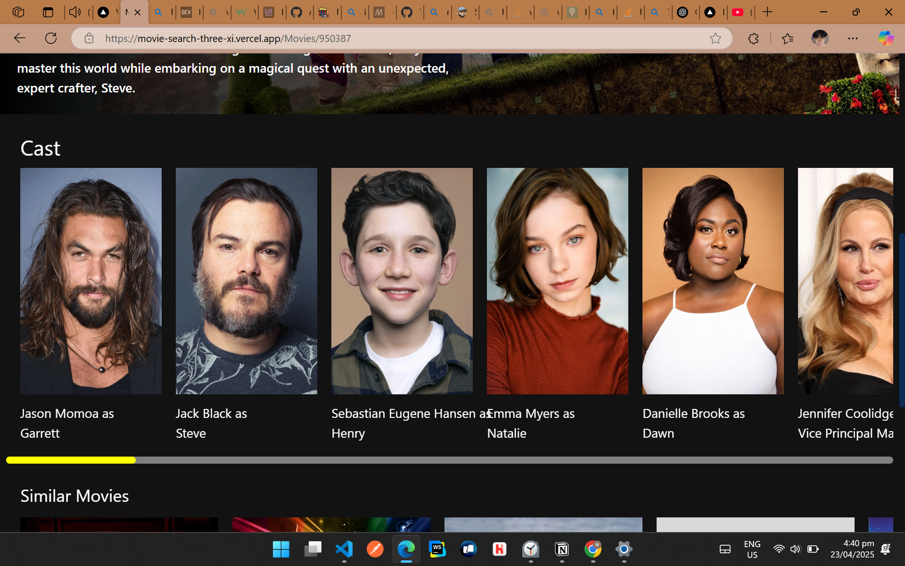
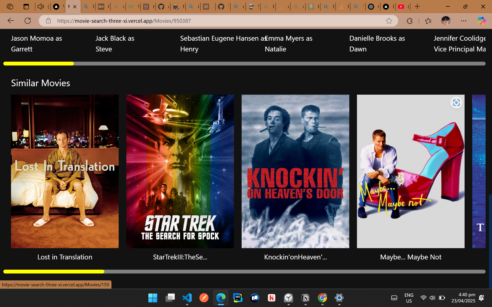

# 🎬 Movie Search

> Discover movies instantly with our sleek and responsive movie search website. Search by title, explore movie details including cast and overviews, and enjoy real-time results powered by a movie API. Designed with React for a fast, seamless user experience, this app helps users find film info quickly—perfect for movie buffs and casual viewers alike.

## 🧷 Live Demo

👉 [View Website](https://movie-search-three-xi.vercel.app/)

## 🌐 Preview

## 🛠️ Built With

- **Technologies:** React.js, JavaScript, Tailwind CSS
- **API:** [TMDB API](https://www.themoviedb.org/documentation/api)
- **Hosting:** Vercel (Frontend)

## ⭐ Features

- 🔍 Search for movies and TV shows
- 🎬 View detailed information for selected titles
- ▶️ Watch trailers (when available)
- 👥 View cast and similar movie suggestions

## 🙏 Credits

This project is inspired by [Drizzy-Db](https://github.com/Tobikun11-Arch/Drizzy-Db) by [@Tobikun11-Arch](https://github.com/Tobikun11-Arch).  
Huge thanks for the inspiration and solid foundation!

## 💼 Open for Commission

I’m currently available for freelance work—especially building static websites!  
Feel free to reach out through the platforms below:

- 📘 [Facebook](https://www.facebook.com/windyl.monton.3)
- 📷 [Instagram](https://www.instagram.com/devwindyl/)
- 💻 [GitHub](https://github.com/Arch-ZeroOne)

---
